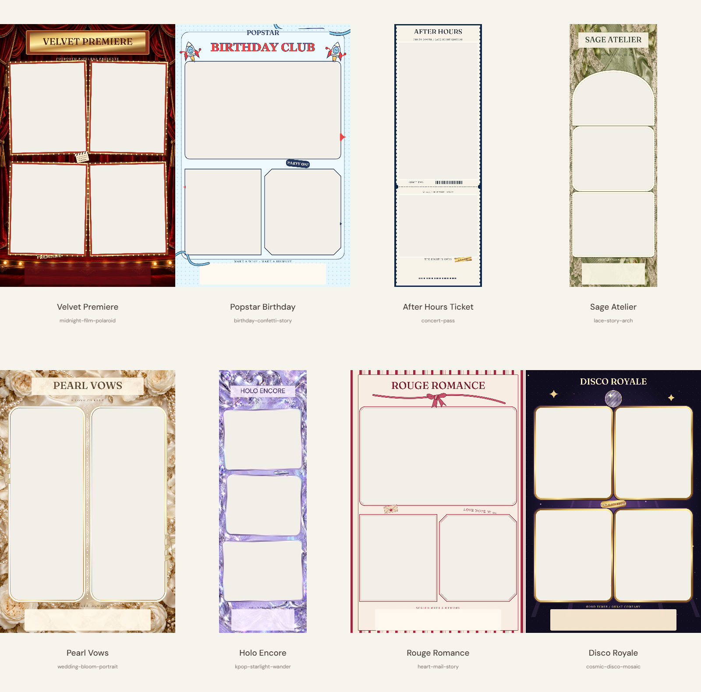

# Fotbooth

Photobooth web berbahasa Indonesia dengan **60 frame**, kamera, unggah foto, editor crop dan unduhan PNG/JPEG. Foto dan caption diproses di browser serta hanya berada di memori tab.

**Situs publik:** [fotbooth.pages.dev](https://fotbooth.pages.dev), diterbitkan 7 Oktober 2026.

Katalog tetap **60 frame**: delapan desain unggulan versi 3 tampil pertama, sementara 52 edisi lainnya memakai versi 2 bergaya cetakan kertas. Desain unggulan: Velvet Premiere, Popstar Birthday, After Hours Ticket, Sage Atelier, Pearl Vows, Holo Encore, Rouge Romance dan Disco Royale. Tirai velvet, lampu marquee, tekstil/renda, sutra/mutiara dan foil holografis membangun tema yang lebih utuh. Ada pencarian nama/deskripsi serta filter kategori, koleksi, format dan jumlah foto.



## Jalankan

Gunakan Node 24.14.1 sesuai `.node-version`; lockfile disertakan.

```powershell
npm ci
npm run dev
```

Buka http://127.0.0.1:5173/. Kamera memerlukan localhost atau HTTPS. Unggah tersedia ketika kamera ditolak.

## Pemeriksaan

```powershell
npm run check
npx playwright install chromium webkit
npm run test:e2e
```

Unit tests memeriksa katalog, geometri, file foto, sesi, crop, teks dan ekspor. Suite browser memuat semua 60 thumbnail/layer, memeriksa interior foto, membuka kembali PNG/JPEG standar/ringan, menguji pencarian, kamera sintetis, editor, keyboard, viewport dan privasi jaringan. Chromium/WebKit otomatis di komputer belum menggantikan pengujian HP/kamera nyata.

Revisi unggulan 7 Oktober 2026 sudah publik. **44 unit test dan build lulus; 61 browser test lulus, 3 skip kamera sintetis WebKit.** Setelah penyempurnaan artwork, empat pemeriksaan katalog/render ulang lulus. Pratinjau dan produksi HTTPS lulus pada Chromium desktop/WebKit 360 px: 60 thumbnail, 180 URL aset, unggah, caption, header keamanan serta 16 unduhan PNG/JPEG untuk kedelapan desain pada setiap engine. Kamera dan tombol tetap terlihat bersamaan pada enam ukuran layar. Kamera fisik dan HP nyata belum diuji. [Bukti revisi](docs/qa/signature-release-20261007.json).

## Cloudflare Pages

Repo public: [alifikri25/fotbooth](https://github.com/alifikri25/fotbooth).

Project `fotbooth` sudah aktif dengan **Direct Upload**, production branch `main`, build `npm run build`, output `dist`. Alamat publik: https://fotbooth.pages.dev. Custom domain belum dipasang. `wrangler.jsonc`, script deploy dan header keamanan tersedia.

Ikuti [panduan Cloudflare](docs/DEPLOY-CLOUDFLARE.md). Untuk revisi berikutnya, setelah pemeriksaan lokal lulus:

```powershell
npm run deploy:preview
# Periksa URL preview HTTPS sebelum menerbitkan revisi:
npm run deploy:cloudflare
```

GitHub Actions menjalankan pemeriksaan pada push/PR; push GitHub belum otomatis menerbitkan revisi. Publikasi memakai script di atas dengan login Cloudflare pengguna. Jangan commit `.env`, API token atau konfigurasi login pengguna.

## Artwork dan dokumentasi

Komposisi dekorasi dibuat sebagai artwork SVG orisinal. Empat bahan raster dan tiga foto contoh model dewasa fiktif dibuat dengan tool imagegen bawaan; [gambar asli, jalur aset dan prompt](artwork/README.md) disimpan dalam repo. Screenshot Canva dari pengguna menjadi referensi arah gaya. Tidak ada file template atau foto referensi yang diimpor. Font DM Sans dan Fraunces dilayani secara lokal, dengan lisensi SIL OFL disertakan.

- [Registry 60 frame](docs/FRAME-REGISTRY.md)
- [Delapan desain unggulan](docs/qa/signature-design-board.png)
- [Contact sheet lengkap](docs/qa/frame-contact-sheet.png)
- [Laporan QA](docs/QA.md)
- [Rencana 60 frame](docs/superpowers/plans/2026-10-06-60-decorated-frames.md)
- [Rilis dan rollback](docs/RELEASE.md)

```powershell
npm run assets:build
# Dengan dev server aktif:
npm run qa:frames
npm run qa:ui
node scripts/write-registry.mjs
```

Generator thumbnail memakai renderer aplikasi dan batch terbatas. `public/frames/{id}/v3` menyimpan delapan paket unggulan; 52 lainnya tetap aktif pada `v2`. Semua aset `v1` dan `v2` sebelumnya tetap tersedia untuk sesi yang sudah terbuka; source manifest berada di `src/frames/manifests`. Board pilihan dan contact sheet disertakan dalam repository; ekspor QA penuh dan arsip lokal tidak ikut Git.

## Batas dukungan

Input: JPG, PNG, WebP diam; maksimal 20 MB, 24 MP per foto dan 8 foto per sesi. Caption maksimal 40 grapheme, history 30 langkah. HEIC, SVG upload, animasi dan URL foto bebas tidak diterima. Akun, draft tersimpan, filter foto, share dan frame builder belum tersedia.

Strip standar: 1200×3600; kartu: 1800×2700. Ukuran ringan tepat setengah. Menutup atau memuat ulang tab mengakhiri sesi.
